# Informe: Trabajo Práctico #4 - Módulos de kernel y llamadas a sistema

**Asignatura:** Sistemas de Computación  
**Institución:** Facultad de Ciencias Exactas, Físicas y Naturales (FCEFyN) – UNC  
**Docente:** Javier Alejandro Jorge  


## Datos del Grupo y Repositorio

* **Integrantes:** 
  - Macarena Vanina González 
  - Marcos Nieto 
  - Mario Pampiglione
* **Repositorio:** [https://github.com/Maca040/SistComp_TeamMergeNoConflict.git](https://github.com/Maca040/SistComp_TeamMergeNoConflict.git)

# Modulos de Kernel
Un Módulo de Kernel Linux se define como un segmento de código capaz de cargarse y descargarse dinámicamente dentro del kernel según sea necesario.
Estos módulos mejoran las capacidades del núcleo sin necesidad de reiniciar el sistema. 
Un ejemplo notable es el módulo de controlador de dispositivo, que facilita la interacción del núcleo con los componentes de Hardware vinculados al sistema. 

En ausencia de módulos, el enfoque predominante se inclina hacia los núcleos monolíticos, que requieren la integración directa de nuevas funcionalidades en la imagen del núcleo.

Este enfoque da lugar a núcleos más grandes y requiere la reconstrucción del núcleo y el subsiguiente reinicio del sistema cuando se desean nuevas funcionalidades.

Para comenzar vamos a necesitar instalar algunas dependencias:
```
sudo apt-get install build-essential checkinstall kernel-package linux-source
```
## DESAFIO #1 
**1)**

**a)¿Qué es checkinstall y para qué sirve?**
 Checkinstall es un programa de código abierto para sistemas operativos Unix-like que facilita la instalación y desinstalación de software compilado desde el código fuente, permitiendo que sea administrado por el sistema de gestión de paquetes nativo del sistema (APT/Dpkg en Debian/Ubuntu, RPM en Fedora/RHEL, o pkgtool en Slackware). A diferencia de make install, donde al ser ejecutado los archivos se dispersan por el sistema sin dejar registro de qué se instaló ni dónde, CheckInstall realiza un monitoreo de la instalación, es decir, intercepta el comando de instalación (como make install por ejemplo) y registra todos los archivos creados o modificados generando un paquete nativo (.deb, .rpm o Slackware) con los archivos instalados. Esto permite desinstalar el software posteriormente usando el gestor de paquetes del sistema, sin tener que buscar archivos manualmente.

**b) Crear un Hello_world y empaquetarlo**

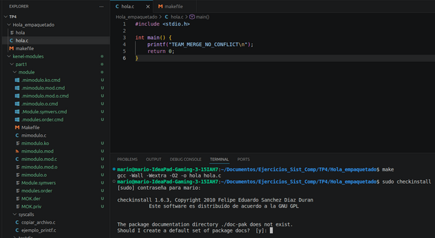
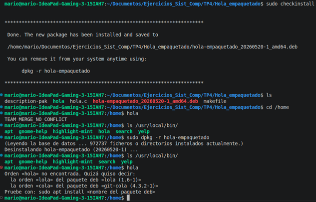

Como se puede apreciar en las dos imágenes se arma el .o con make, luego se hace uso de checkinstall que en este ejemplo se encarga empaquetar en un .deb e instalar en /usr/local/bin/ según se especificó en el makefile. Al ejecutar hola posicionado en algún directorio (home en este caso) debería ser visible en consola la respuesta (“TEAM_MERGE_NO_CONFLICT”) de nuestro programa instalado. “ls /usr/local/bin/” en este caso puntual es usado solo para mostrar el hecho de que existe “hola” una vez completada la instalación y desaparece tras la inmediata desinstalación efectuada por dpkg (“sudo dpkg -r hola-empaquetado”). Por último se intenta llamar nuevamente al programa para dejar claro que efectivamente este ya no está disponible (es un agregado un poco más visual al hecho de haberse cerciorado de que ya no estaba en /usr/local/bin/).

**c)Seguridad del Kernel**

**Rootkits:** es un software malicioso que da acceso privilegiado al sistema mientras se oculta, modificando el kernel u otros componentes.

Dado que la seguridad del kernel de linux es importante para proteger sistemas contra amenazas como los módulos no firmados y rootkits, nombramos a continuación algunas de las medidas que podemos implementar para mejorar la seguridad del Kernel.

- **Firmar módulos del Kernel:** El kernel de linux permite extender sus funcionalidades mediante módulos, que son piezas de código cargadas dinamicamente.
    El hecho de tener módulos no firmados pueden representar riesgos ya que podrían contener algún tipo de malware.
    
    En sistemas con **Secure Boot**, los módulos deben estar firmados con una clave privada y verificados con la clave pública


- **Habilitar Secure Boot:**
    Esto se encuentra disponible en firmware UEFI y requiere que todos los cargadores de arranque y módulos de kernel estén firmados con claves de confianza

- **Configurar module.sig_enforce:** esto se utiliza para rechazar los módulos sin firma.+


## DESAFIO #2
**2)**

**a) ¿Qué funciones tiene disponible un programa y un módulo?** 
Un programa en espacio de usuario puede usar (y en general hace uso) de la biblioteca estándar de C, además de otras bibliotecas que el usuario pueda querer agregar y todas las definiciones de las funciones que se encuentren en el programa y hagan uso de esas bibliotecas van a ser resueltas en la etapa de linkeo. En el caso de los módulos las funciones a las que tienen acceso están definidas en /proc/kallsyms y las definiciones de esos símbolos pertenecientes al archivo objeto que es en sí el módulo se resuelven cuando se ejecuta insmod o modprobe.

**b)Espacio de Usuario - Espacio de Kernel** 
El kernel gestiona el acceso a recursos por parte de los procesos asegurando que no se haga un acceso a los mismos de forma indiscriminada (además de todas las otras tareas que tiene el kernel sobre los procesos como es protección, integridad, etc.). Las CPU (específicamente intel 80386 en este caso) tiene cuatro niveles de privilegio de los cuales los sistemas Unix usan dos: el de mayor privilegio como supervisor y el de menor como usuario (anillos 0 y 3 respectivamente). Respecto al espacio de usuario y espacio de kernel en general los programas que se usan cotidianamente trabajan a nivel de usuario y existen tres maneras básicas de pasar de nivel de usuario a nivel de kernel: a través de llamadas a sistema, por interrupciones o por excepciones. El primer caso es efectivamente un paso de usuario a kernel, en el caso de interrupciones o excepciones no necesariamente significa un cambio de modo ya que podría estar ejecutando código en kernel y manejar una interrupción o excepción como una entrada a un nuevo contexto de ejecución pero en el kernel todavía, lo que en sí implica que no hubo ningún cambio de modo.

**c) Espacio de Datos**
 El Espacio de Datos en la programación de módulos hace referencia a la región de memoria donde el kernel almacena sus variables globales, estructuras y buffers. A diferencia de los procesos de usuario que se ejecutan de forma aislada, el kernel y todos sus módulos comparten un único entorno de memoria continua. Dentro de este entorno global conviven el Code Space, donde se ejecutan las instrucciones compartidas, y el Name Space, el cual exige que todos los símbolos y variables definidos en los datos sean únicos para evitar conflictos a nivel de todo el núcleo.

Dado que no existen barreras de protección de memoria en este espacio compartido, el manejo de los datos es fundamental. Un error en un módulo puede corromper las variables de otros componentes o del propio kernel, provocando la caída de todo el sistema. Siguiendo esta arquitectura, un módulo jamás puede acceder directamente a los datos de un programa de usuario, teniendo que utilizar siempre las funciones seguras de la API del kernel para transferir información entre ambos espacios.

**d) Drivers** 
Los drivers son un tipo de módulo que se encarga de hacer la conexión entre el archivo que define mi elemento de hardware (que no necesariamente es un componente exacto, es algo más abstracto porque por ejemplo en el caso de los discos se pueden ver archivos asociados a las particiones) en /dev y el elemento puntual. Esto permite a programas que quieran acceder por ejemplo a alguna característica asociada con el audio que directamente usen el archivo que se encuentra en /dev (/dev/audio) y el driver se encargue de la conexión con la placa de audio concreta. Si se lista el contenido de /dev con “ls -l” se pueden observar entre otras cosas dos números separados de una coma. El primer número es el número mayor y hace referencia al driver que controla al dispositivo, el segundo es el número menor y especifica qué hardware de todos los asociados al driver se está viendo. Al acceder a un dispositivo el kernel solo precisa del número mayor, esto deja en claro que es el controlador el que se ocupa del número menor, utilizándolo para diferenciar entre los distintos componentes de hardware. Volviendo nuevamente a la ejecución de “ls -l” para ver /dev hay algo importante a mencionar: existen dos tipos de archivos de dispositivos, de bloque y de caracter. Los de bloque tienen un búfer para las solicitudes, lo que les permite elegir el orden óptimo para responderlas y además solo pueden aceptar entrada y devolver salida en bloques a diferencia de los dispositivos de caracter que pueden utilizar tantos bytes como necesiten.

-----------------------------------------------------------------------------------------------------------  
### Consignas
**1)**¿Qué diferencias se pueden observar entre los dos modinfo?

En base a la imagen adjunta en la que se puede ver la salida de modinfo completa para “mimodulo.ko” y casi completa para “/lib/modules/$(uname -r)/kernel/crypto/des_generic.ko.zst” la principal diferencia que se puede observar es la existencia de alias que en el caso del módulo hecho por nosotros no tiene. Además de la longitud de la firma a favor del módulo crypto que lamentablemente no se logra apreciar en esta captura se ven diferencias en las dependencias y en el hecho de que este módulo se distribuye junto con el kernel, es decir, es parte del mismo y eso se indica en “intree: Y” que en nuestro módulo no está.  

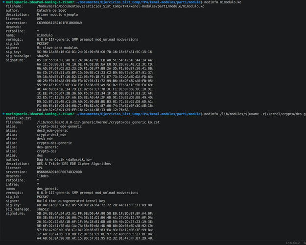

  
**2)** ¿Qué divers/modulos están cargados en sus propias pc?

Para poder hacer esto,ejecutamos el siguiente comando con el que se carga toda la lista de los modulos/drivers en nuestra carpeta outputs:
    ``` lsmod > outputs/modulos_cargados0.txt
    ```
Y para ver las diferencias utilizamos la pagina [diff checker](https://www.diffchecker.com/) cuya salida es la siguiente:


**3)** ¿Cuáles no están cargados pero están disponibles? que pasa cuando el driver de un dispositivo no está disponible.

Todos aquellos módulos que se encuentren en “/lib/modules/uname -r”  son los que están disponibles y los que se pueden ver en lsmod (o en su defecto cat /proc/modules) son los cargados en el momento. En el caso de que un driver de dispositivo esté en “/lib/modules/uname -r” y no se haya levantado se puede hacer manualmente o forzar la carga automática para que aparezca luego en lsmod, en caso de ni siquiera existir el .ko el dispositivo queda sin drivers asociado y por ende no puede ser utilizado hasta que se instale el paquete necesario.

**4)** Correr hwinfo en una pc real con hw real y agregar la url de la información de hw en el reporte.

 URL generada :
 https://linux-hardware.org/?probe=9b15e49952  


**5)** ¿Qué diferencia existe entre un módulo y un programa?

Un programa se ejecuta en espacio de usuario, usa funciones de bibliotecas ya sea de libc o alguna otra especializada especificada por el programador y tiene una función “main” principal. Un módulo se ejecuta en espacio de kernel, accede a funciones definidas en kallsyms y no tiene una función “main”, su estructura se basa principalmente en “module_init” y “module_exit”.  

**6)** ¿Cómo puede ver una lista de las llamadas al sistema que realiza un simple helloworld en c?


Suponiendo un programa sencillo que imprime “hello” se compila al mismo con “gcc -Wall -o hello hello.c” y se corre el ejecutable con “strace ./hello”. Esto muestra en consola todas las llamadas al sistema que el proceso y sus hijos realizan.  

**7)** ¿Qué es un segmentation fault?¿Cómo maneja el kernel  y como lo hace un programa?

Un segmentation fault es una violación de acceso a memoria detectada por el hardware (la MMU en sí). Este fallo se lanza cuando un programa intenta leer, escribir o ejecutar una dirección de memoria que no está mapeada en su espacio de direcciones, acceder a una página con permisos insuficientes (escribir en una página de solo lectura, ejecutar código en una página no ejecutable) o usar direcciones en el rango reservado del kernel desde espacio de usuario.   
En caso de que un programa en espacio de usuario cometa un error el manejador de excepciones del kernel envía un “SIGSEGV” al proceso que causó la falta y el kernel y los demás procesos siguen funcionando sin problema.  
Para el caso del kernel cuando la MMU detecta la violación la CPU genera la excepción, el manejador del kernel examina la dirección que falló y el contexto. Como el fallo provino del propio código del kernel se invoca la función __die() (o variantes) que imprime un “Oops”, i.e., un volcado de los registros, la pila de llamadas y el estado del proceso actual. El kernel muere y se requiere un reinicio.  

**8 y 9)** Intento de firmar un módulo de kernel : Documentación y evidencia.
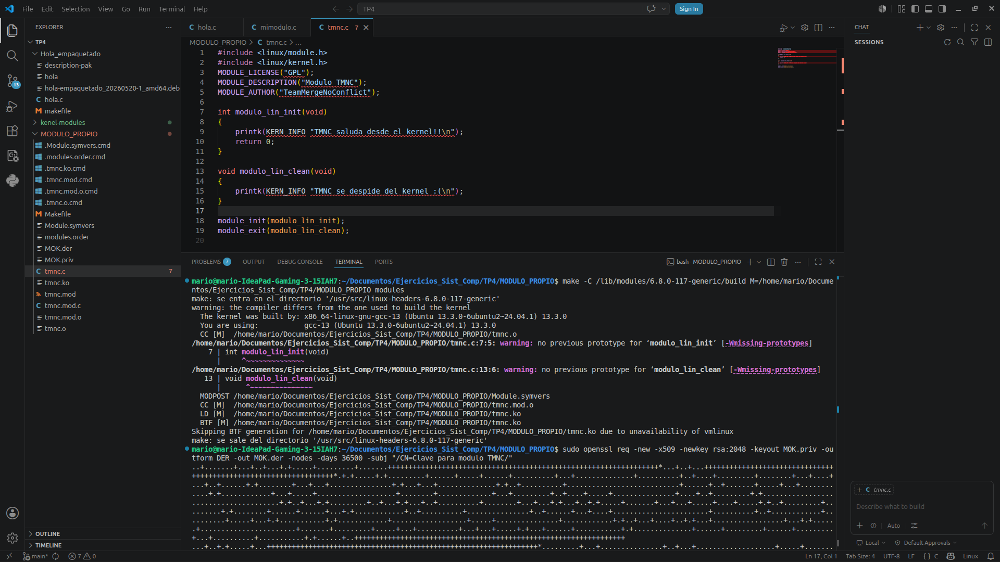

  
Lo primero que se hace es ejecutar “make -C /lib/modules/6.8.0-117-generic/build M=/home/mario/Documentos/Ejercicios_Sist_Comp/TP4/MODULO_PROPIO modules” donde “6.8.0-117-generic” es el reemplazo efectivo de “unamed -r”.

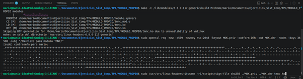

  
Seguido se procede con la creación de una clave privada (MOK.priv) y un certificado público (MOK.der) para firma y verificación de módulo con “sudo openssl req -new -x509 newkey rsa:2048 -keyout MOK.priv -outform DER -out MOK.der -nodes -days 36500 -subj “/CN=Clave para modulo TMNC”/”; importante mencionar que en este paso se pide crear una clave que es necesaria más adelante. Luego se firma el módulo con “sudo /usr/src/linux-headers-uname -r/scripts/sign-file sha256 ./MOK.priv ./MOK.der mimodulo.ko” indicando que se usa cifrado sha256.  

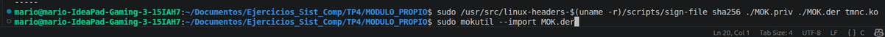

  
Para que el Arranque Seguro acepte el módulo es necesario inscribir el certificado público en la lista de Claves del Propietario de la Máquina (MOK) con “sudo mokutil --import MOK.der”.  
Una vez realizado todo esto se procede a reiniciar la PC e interactuar con el MOK management.  

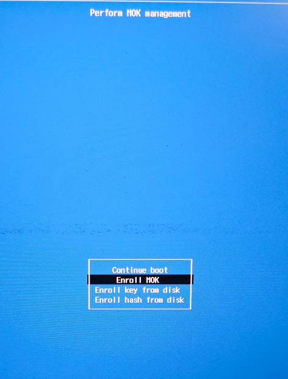

  
Se selecciona “Enroll MOK”. Algunos de los pasos subsiguientes no van a ser dejados por escrito porque la imagen es lo suficientemente explicativa.  

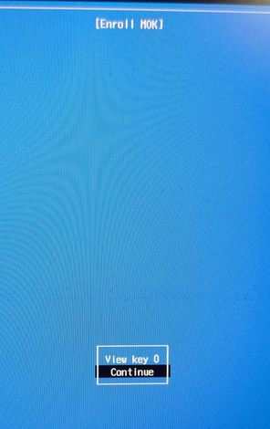

  

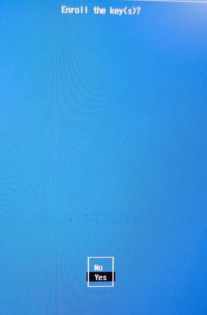

  
En este paso intermedio es necesario introducir la clave que se había definido previamente, a continuación de ello se debe hacer reboot.  

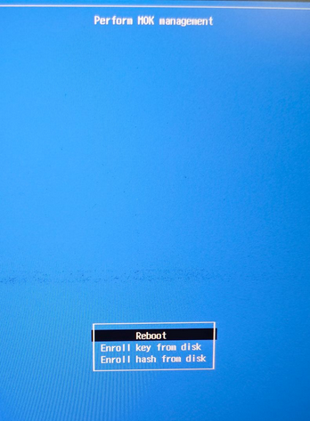

  
Una vez cumplido todo esto es posible cargar el módulo y firmado con “sudo insmod tmnc.ko”. Para este ejemplo se introduce el módulo y se retira inmediatamente para mostrar la entrada y la salida del mismo en los registros de kernel con “sudo dmesg | tail” donde “| tail” es usado para mostrar solo la cola (o parte final) de todo el mensaje que se imprime por consola.  

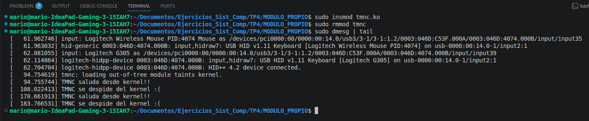

  

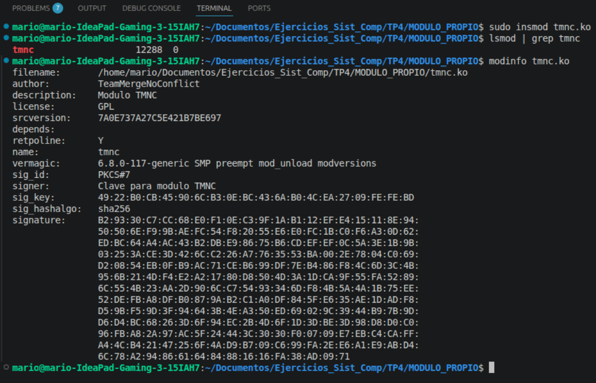

  
Finalmente se carga una última vez para poder acceder desde lsmod (para modinfo no es necesario insertar el módulo).

**10)** ¿Que pasa si mi compañero con secure boot habilitado intenta cargar un módulo firmado por mi? 

Si mi compañero tiene Secure Boot activado, su sistema solo permite cargar módulos del kernel que estén firmados digitalmente con una clave reconocida como segura. Esto forma parte de una medida de seguridad que evita la ejecución de código malicioso a bajo nivel (como rootkits).

Si yo firme mi módulo con una clave propia (que no está registrada en su sistema), el kernel va a rechazar la carga del módulo, incluso si está correctamente firmado. Mostrará un error indicando que la firma no es válida o que falta la clave.

Para que pueda cargarlo, tendría que importar mi clave pública al sistema usando herramientas como mokutil, y luego autorizarla manualmente al reiniciar, para que Secure Boot la reconozca como confiable.

Con Secure Boot activo, no alcanza con firmar el módulo, también es necesario que la clave usada esté autorizada por el sistema.


**11)** Basado en la siguiente nota https://arstechnica.com/security/2024/08/a-patch-microsoft-spent-2-years-preparing-is-making-a-mess-for-some-linux-users/ :

- **¿Cuál fue la consecuencia principal del parche de Microsoft sobre GRUB en sistemas con arranque dual (Linux y Windows)?**

    Los sistemas ya no podían iniciar Linux debido a una violación de política de seguridad del Secure Boot.

    
- **¿Qué implicancia tiene desactivar Secure Boot como solución al problema descrito en el artículo?**

    Desactivar Secure Boot implica comprometer la seguridad del sistema, ya que Secure Boot impide la carga de código no firmado durante el arranque. Al desactivarlo para permitir la carga de controladores o módulos que el parche de Microsoft bloquea, se abre la posibilidad de que malware o rootkits se carguen sin restricciones al iniciar el sistema.

- **¿Cuál es el propósito principal del Secure Boot en el proceso de arranque de un sistema?**

    Verificar que solo se ejecuten binarios firmados y autorizados durante el arranque.